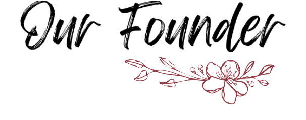

<div align="center">
  
  
  # 🌸 **PadSeva** - Empowering Dignity Through Technology
  
  ### *Eradicating period poverty • Promoting menstrual hygiene • Empowering rural communities*
  
  
  
  
  
  
  
  [](https://opensource.org/licenses/MIT)
  [](http://makeapullrequest.com)
  [](https://GitHub.com/SyedAdeebWebDesigning/padseva/graphs/commit-activity)
  
</div>

---

## 🌟 **Our Impact**

<div align="center">
  
  **📈 7,500+** Biodegradable Pads Distributed | **👥 9,000+** Lives Transformed | **🏘️ 50+** Rural Communities Reached
  
  *Building a world where menstrual health is a right, not a privilege*
  
</div>

---

## 🛠 **Tech Stack**

<table align="center">
  <tr>
    <td align="center"><strong>Frontend</strong></td>
    <td align="center"><strong>Backend</strong></td>
    <td align="center"><strong>Database</strong></td>
    <td align="center"><strong>Authentication</strong></td>
  </tr>
  <tr>
    <td align="center">
      
      <br />Next.js 14 • React 18 • TypeScript • TailwindCSS
    </td>
    <td align="center">
      
      <br />Node.js • API Routes • Server Actions
    </td>
    <td align="center">
      
      <br />MongoDB • Mongoose ODM
    </td>
    <td align="center">
      
      <br />Clerk Authentication
    </td>
  </tr>
</table>

### 🔧 **Additional Technologies**

- **🎨 Animation**: Framer Motion & Advanced CSS Animations
- **📧 Email Service**: Nodemailer for Newsletter & Notifications
- **📱 UI Components**: Radix UI Primitives
- **🎯 Analytics**: Vercel Analytics
- **🔐 Security**: Role-based Access Control (Admin/Volunteer)
- **📊 Forms**: React Hook Form + Zod Validation
- **🚀 Deployment**: Vercel with Edge Functions
- **📦 Package Manager**: npm with dependency optimization

---

## ✨ **Key Features**

<div align="left">
  
- 🔐 **Advanced Authentication System** - Secure user management with role-based access
- 👥 **Multi-Role Dashboard** - Separate interfaces for Admins and Volunteers
- 📧 **Email Verification System** - Automated newsletter subscription with verification
- 📊 **Real-time Analytics** - Impact tracking and journey visualization
- 🎨 **Modern UI/UX** - Responsive design with smooth animations
- 📱 **Mobile-First Design** - Optimized for all device sizes
- ⚡ **Performance Optimized** - Next.js 14 with App Router and Server Components
- 🌍 **SEO Optimized** - Meta tags, structured data, and sitemap integration
- 📰 **Newsletter Management** - PDF newsletter distribution system
- 🎯 **Social Integration** - Seamless social media connectivity
- 🔒 **Data Security** - GDPR compliant with secure data handling
- 🚀 **CI/CD Pipeline** - Automated deployment and testing
  
</div>

---

## 🌍 **About PadSeva**

<div align="center">
  
</div>

At **PadSeva**, we are revolutionizing menstrual health in rural Southern India through technology and compassion. Our mission transcends traditional charity work – we're building a sustainable ecosystem that combines innovative **bamboo-based biodegradable sanitary pads** with comprehensive educational initiatives.

### 🎯 **Our Mission**

<div align="center">
  
  
  *"Empowering communities, one pad at a time. We believe in dignity, equality, and the basic right to menstrual hygiene."*
  
</div>

**Why This Matters:**
- 🏠 **Rural Focus**: Addressing the unique challenges faced by remote communities
- 🌱 **Sustainable Impact**: Biodegradable products that protect both women and the environment
- 📚 **Education First**: Breaking taboos through awareness and open conversations
- 🤝 **Community-Driven**: Working with local leaders and organizations
- 💡 **Innovation**: Leveraging technology to scale our impact efficiently

### 📈 **Our Journey So Far**

- **🎯 Impact Metrics**: 7,500+ pads distributed across 50+ rural communities
- **👥 Lives Transformed**: Reached 9,000+ individuals with education and resources
- **🏆 Recognition**: Featured in local media and community development programs
- **🤝 Partnerships**: Collaborated with NGOs, schools, and healthcare centers
- **📱 Digital Innovation**: Developed this comprehensive web platform for greater reach

---

## 👨‍💻 **Meet Our Founder**

<div align="center">
  
  
  
  
  ### **Syed Adeeb** 
  *Full-Stack Developer & Social Entrepreneur*
  
  Passionate about using technology to solve real-world problems and create lasting social impact.
  
  [](https://github.com/SyedAdeebWebDesigning)
  [](https://linkedin.com/in/syedadeeb)
  
</div>

---

## 🚀 **Quick Start**

### Prerequisites
- Node.js 18+ and npm
- MongoDB database
- Clerk account for authentication

### Installation

```bash
# Clone the repository
git clone https://github.com/SyedAdeebWebDesigning/padseva.git
cd padseva

# Install dependencies
npm install

# Set up environment variables
cp .env.example .env.local
# Add your MongoDB URI, Clerk keys, and other secrets

# Run the development server
npm run dev
```

### Environment Variables

```env
MONGODB_URI=your_mongodb_connection_string
NEXT_PUBLIC_CLERK_PUBLISHABLE_KEY=your_clerk_public_key
CLERK_SECRET_KEY=your_clerk_secret_key
# Add other required environment variables
```

### 🌐 **Production Deployment**

This application is optimized for **Vercel** deployment:

1. Connect your GitHub repository to Vercel
2. Configure environment variables in Vercel dashboard
3. Deploy automatically on every push to main branch

---

## 🤝 **Contributing**

We welcome contributions from developers, designers, and social impact enthusiasts!

### How to Contribute

1. **Fork** the repository
2. **Create** a feature branch (`git checkout -b feature/amazing-feature`)
3. **Commit** your changes (`git commit -m 'Add amazing feature'`)
4. **Push** to the branch (`git push origin feature/amazing-feature`)
5. **Open** a Pull Request

### Development Guidelines

- Follow TypeScript best practices
- Use conventional commit messages
- Ensure responsive design principles
- Test on multiple devices and browsers
- Maintain accessibility standards (WCAG 2.1)
- Document new features and API changes

### Code of Conduct

We follow the [Contributor Covenant](https://www.contributor-covenant.org/) Code of Conduct. Please read it before contributing.

---

## 🌐 **Connect With Us**

<div align="center">
  
  [](https://www.linkedin.com/company/padseva/)
  [](https://www.instagram.com/pad.seva/)
  [](https://padseva.vercel.app)
  
  **📧 Get in touch**: hello@padseva.org
  
</div>

---

## 💝 **Support Our Mission**

Every contribution makes a difference in someone's life:

- 🌟 **Star this repository** to show your support
- 🔄 **Share** our mission with your network
- 💰 **Donate** to help us reach more communities
- 🤝 **Volunteer** your skills and time
- 📢 **Spread awareness** about menstrual health

---

<div align="center">
  
  ## 🌸 *"Technology serving humanity, one line of code at a time."*
  
  **Together, we can create a world where menstrual health is accessible to all.**
  
  ---
  
  **Made with ❤️ by the PadSeva Team** | **© 2024 PadSeva Initiative**
  
  [](https://choosealicense.com/licenses/mit/)
  
</div>
